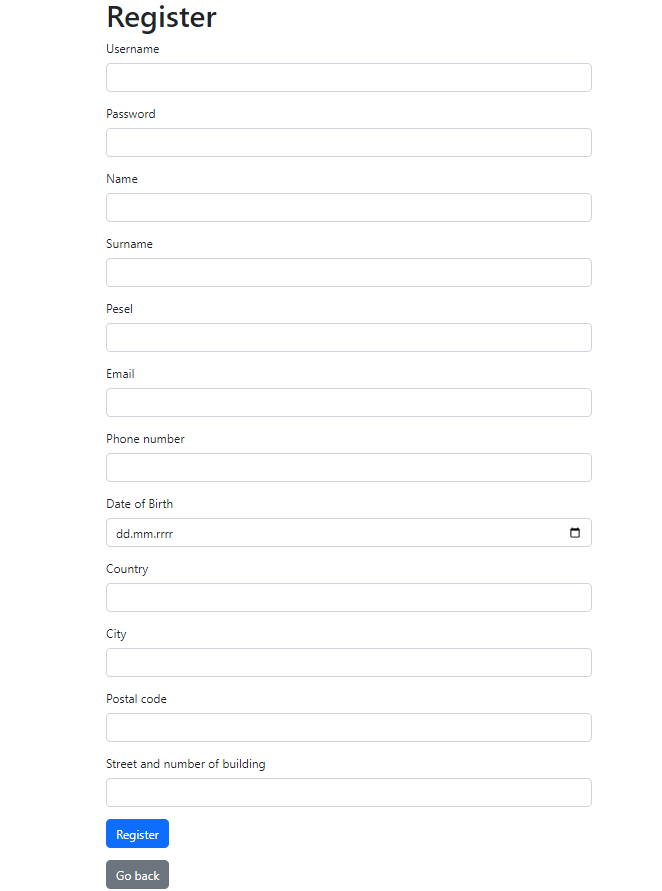

Project contains:
* Entity RelationShip Diagram - check out ERD.jpg
* Swagger-UI - after running project localy you can check it out at: http://localhost:8087/medconnect/swagger-ui/index.html or copy contract from Contract.txt and paste it to: https://editor.swagger.io/ 
* docker-compose.yaml contains instructions for creating container. To create docker container run "gradle build" command and then "docker compose up -d"
 

DataInitializer.class provides 4 defaults users while starting project.
You can login as patient using usernames: Patient1 or Patient2
You can login as doctor using usernames: Doctor1 or Doctor2
all of them has same password: test

Our Doctor page doesn't require logging in and provides information about doctors:

   

User can register as new patient:

   
 
Patient's portal is available for users logged as Patient and provides functionalities:

1) patient can change his photo by choosing jpg or png file from his computer
2) patient can see history of his visits and eventually cancel upcoming one
3) patient can make new visit, after choosing available doctor patient will be redirected to new-visit page 
when he can choose available time slot

   
   

Doctor's portal is available for users logged as Doctor and provides functionalities:
1) Doctor can see old and upcoming visits
2) Doctor can choose certain visit and add note to it
3) Doctor can check patients data by typing patients pesel (eg. 21212121211 or 12121212121)
4) Doctor can add his availability days

   
   

